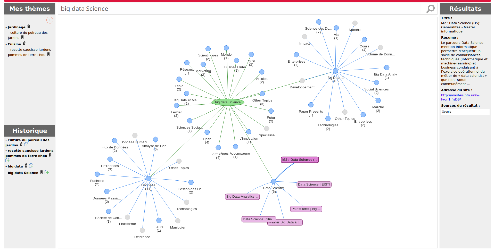

# REMASCO Search


### REMASCO Search is a PHP / JavaScript Application to represent Web Search Results in clustered graphs.  
  
Pre-requisites

Tested on GNU/Linux Debian 9.3.0-amd64 but may be installable on any Microsoft Windows or Linux Server

* DataBase : MySQL
* Server Language : PHP
* Language Libraries : libapache2-mod-php, php-curl, php-xml, php-mysql
* Client Language : AngularJS / Vis.js / Javascript (Chrome Latest)
* Clustering Server (see below)
      * Carrot2 Document Clustering Server, Open-Source version, witch require Java Runtime Environment (JRE) version 1.7.0 or later.
      * Any compatible clustering server based on Carrot2 XML / JSON results.
      * MyDataball API Clustering Service, witch require an user license token.

For licenses compatibility informations: http://www.gnu.org/licenses/licenses.en.html


### Installation

* Install Java Runtime Environment (tested with OpenJDK 8u151-b12-1)
```
# apt install default-jre-headless
```
* Install Apache Web Server (tested with Apache 2.4.25)
```
# apt install apache2
```
* Install PHP and its dependencies (tested with PHP 7.0)
```
# apt install php libapache2-mod-php php-curl php-xml
```
* Install MariaDB and its dependencies (tested with MariaDB 10.1.26)
```
# apt install mariadb-server mariadb-client php-mysql phpmyadmin
```
* Unzip the remasco archive at the public root directory of the web server
```
# cd /var/www/
# unzip remasco.zip
```
* Create Remasco Database and create DBO User by replacing dbouser and dbopassword below
```
# mysql -u root -p
CREATE DATABASE remasco;
CREATE USER 'dbouser'@'localhost' IDENTIFIED BY 'dbopassword';
GRANT ALL PRIVILEGES ON remasco.* to 'dbouser'@'localhost';
FLUSH PRIVILEGES;
quit
```
* Update Remasco Database with script sql/remasco.sql
```
# mysql -p -u[dbouser] remasco < sql/remasco.sql
```

### Configuration

All the REMASCO Search parameters are store in `conf/config.php`. An example version of this file is provide as `conf/config.php.example` file.

* Make a copy of this file and rename it `conf/config.php`
* Adapt parameters to fit your needs, all parameters are documented
* Finaly, adapt your Apache configuration to point your default webroot directory to /var/www/remasco

### Open-Source Version

**REMASCO Search use the open-source version of Carrot2 clustering engine, developed by the Carrot2 Project**, Copyright (C) 2002-2017, Dawid Weiss, Stanisław Osiński. All rights reserved.

This package contains the open source version of the 3.15.1 version of [Carrot2 DCS Server](http://project.carrot2.org).

You can obtain the lastest binary code at [Carrot2.org](http://project.carrot2.org/download.html) or the source code at [GitHub](https://github.com/carrot2/carrot2).

The version provided here must be launch by hand on server.

If you want to launch Carrot2 DCS Server at startup, adapt to your need the debian init.d script `carrot2-dcs` provided in sub-directory `service`.

### Enhanced Version

REMASCO Search can also use **MyDataBall Search API** as Document Clustering Server.

MyDataBall Search API is based on the **Lingo3G clustering Server with more clusters, more depth and/or more results to be clustered**.

MyDataball Search API can only be used with a token provided by purchase of a license.

To enable and use MyDataBall Search API :

* Request an Access Token to MyDataBall by e-mail to <contact@mydataball.com>.
* Modify your conf/config.php file
    * In the `dcs_type` parameter, enter `api`
    * In the `clustering_server` parameter, enter `search.mydataball.com` 
    * In the `dcs_token` parameter, enter the token provided by mail by MyDataball

### User Administration

* To change the default admin/password credentials, use MySQL Command Line Interface
```
# mysql -p -u[dbouser] remasco
UPDATE `user` SET `password`=MD5("[newpassword in clear text]") WHERE `userName`="admin";
quit
```
* To add a new user, use MySQL Command Line Interface and replace words in brackets by the new user informations.
```
# mysql -p -u[dbouser] remasco
INSERT INTO `user` (`userName`, `lastName`, `firstName`, `e-mail`, `password`, `teacher`) VALUES ('[New_UserName]', '[New_LastName]', '[New_FirstName]', '[New_Email_Address]', MD5('[NewPassword]','1'));
```
* To delete a user, use MySQL Command Line Interface
```
# mysql -p -u[dbouser] remasco
DELETE FROM `user` WHERE `userName`="[UserName_to_delete]";
```
* If you prefer, install phpmyadmin and use it to mydify or create user accounts.

### Usage

* If you configure REMASCO Search to use local clustering server and if the Carrot2 DCS Server is not launched at startup, launch Carrot2 DCS Server with 
```
# cd /var/www/remasco/carrot2-dcs-3.15.1
# ./dcs.sh
```

* Point your web browser to your webserver ip address
```
http://yourwebserver
```
* Enter in Remasco App with default login `'admin'` and default password `'admin'`.


### License

    This program is free software: you can redistribute it and/or modify
    it under the terms of the GNU General Public License as published by
    the Free Software Foundation, either version 3 of the License, or
    (at your option) any later version.

    This program is distributed in the hope that it will be useful,
    but WITHOUT ANY WARRANTY; without even the implied warranty of
    MERCHANTABILITY or FITNESS FOR A PARTICULAR PURPOSE.  See the
    GNU General Public License for more details.

    You should have received a copy of the GNU General Public License
    along with this program.  If not, see <http://www.gnu.org/licenses/>.
